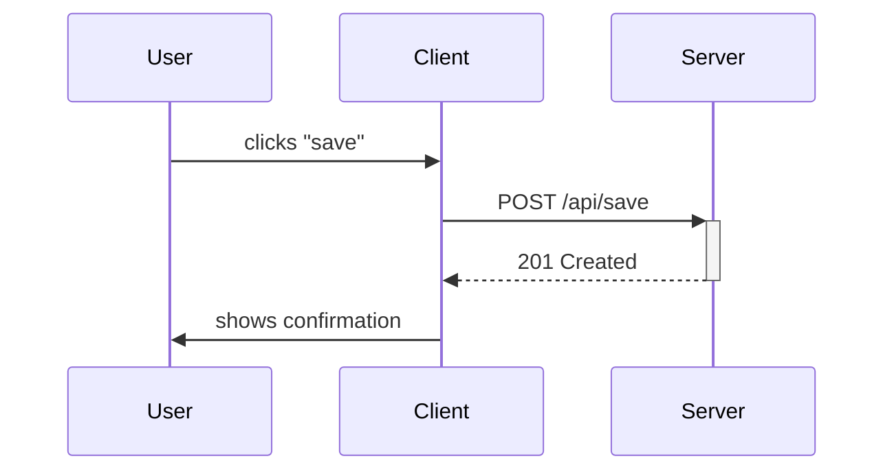
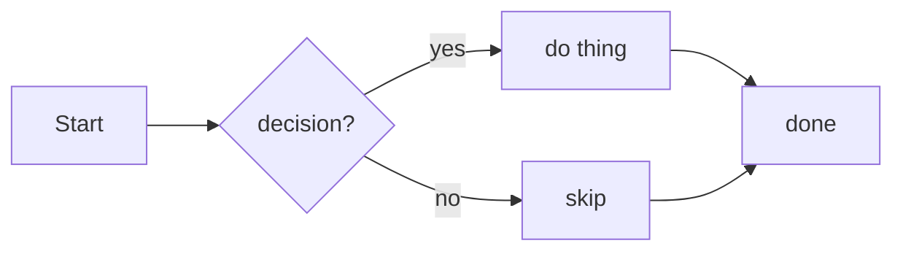

<!-- generated-from-dump2 -->
# Mermaid — Text-Based Diagrams in Markdown

JS library + DSL for embedding diagrams as text inside Markdown. GitHub, GitLab, Obsidian, Notion, and a long tail of editors render ` ```mermaid ... ``` ` code fences in place by shipping mermaid client-side. Supported diagram types: flowcharts, sequence diagrams, class/ER, state machines, Gantt, pie/quadrant charts, git graphs, mind maps, sankey, timelines, C4 architecture, packet/network. Each diagram type has its own grammar parsed by a hand-rolled / jison parser. The "Markdown for diagrams" framing is the actually important part — you commit the source text, not a binary, so diagrams diff and merge.





## References
- <https://github.com/mermaid-js/mermaid>
